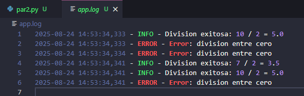
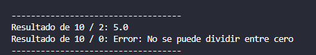
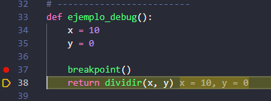
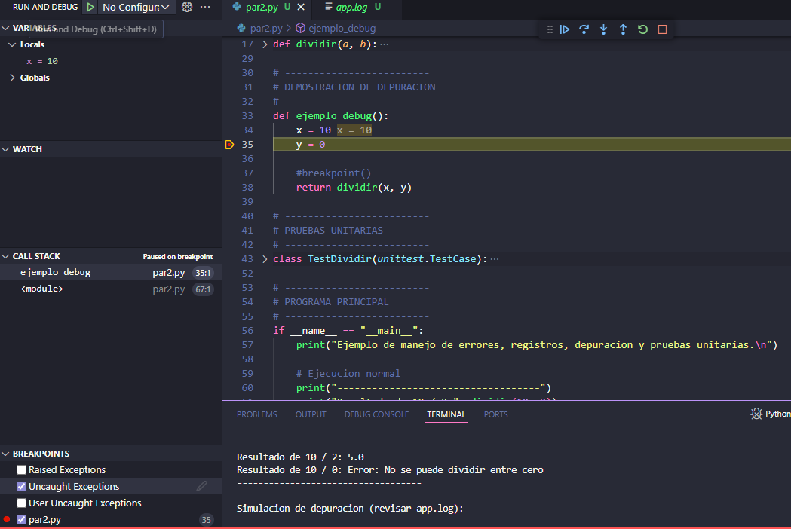
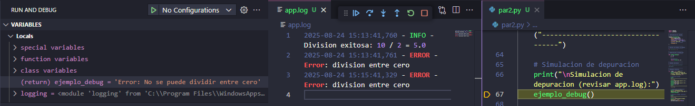
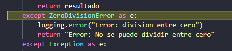
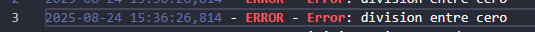
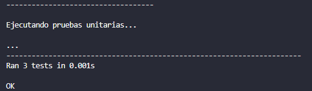
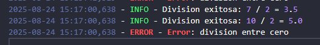

# 📝 Manejo de Errores, Logging, Debugging y Pruebas en Python  

Este proyecto es un ejemplo de manejo de errores, registros (logging), depuración y pruebas unitarias en Python. El contiene funciones para dividir números, registrar eventos, simular depuración y realizar pruebas automáticas.

---

## 📂 Estructura del Código  

### 1. ⚙️ Configuración de Logging  

El código utiliza el módulo `logging` para registrar eventos importantes en el archivo `app.log`.  
- **Nivel:** INFO  
- **Formato:** Fecha, nivel y mensaje  
- **Archivo:** `app.log` (modo escritura, sobrescribe en cada ejecución)

Al ejecutar el programa se genera el archivo app.log el cual sirve para registrar mensajes (información, advertencias, errores, etc.) en un archivo o en la consola. 

📸 Ejemplo del archivo generado:  


---

### 2. ➗ Función `dividir(a, b)`  

```python
def dividir(a, b):
    """Divide dos numeros con manejo de excepciones"""
    try:
        resultado = a / b
        logging.info(f"Division exitosa: {a} / {b} = {resultado}")
        return resultado
    except ZeroDivisionError as e:
        logging.error("Error: division entre cero")
        return "Error: No se puede dividir entre cero"
    except Exception as e:
        logging.exception("Ocurrio un error inesperado")
        return f"Error: {e}"
```

**¿Cómo funciona?**  
- Recibe dos números `a` y `b`.
- Intenta dividir `a` entre `b`.
- Si la división es exitosa, registra el resultado en el log y lo retorna.
- Si ocurre una división por cero, registra el error y retorna un mensaje de error.
- Si ocurre cualquier otro error, lo registra como excepción y retorna el mensaje correspondiente.

📸 Ejemplo de excepción registrada:  


---

### 3. 🐞 Función `ejemplo_debug()`  

```python
def ejemplo_debug():
    x = 10
    y = 0
    #breakpoint()  
    return dividir(x, y)
```

**¿Qué hace?**  
- Define dos variables: `x = 10` y `y = 0`.
- Llama a la función `dividir(x, y)` para provocar un error de división por cero.
- (Hay una línea comentada para activar un breakpoint y facilitar la depuración).

💡 se agregó un break point para poder hacer la depuración mediante el debug de Visual studio code

📸 Activando el breakpoint:  


👉 seguidamente en el debug se nos marca la parte en el punto del breakpoit y nos mostrara los valores de las variables que tenemos en ese momento

📸 Ejemplo debug parte 1:  


👉 al llegar a la parte que manda llamar a la función debug aparece que return sera el error y se agregara al archivo app.log la excepción 

📸 Ejemplo debug parte 2:  


👉 ya que como parte de las excepciones en la división tenemos registrado que cuando se detecte ese error se lance la excepción de ZeroDivisionError

📸 Error capturado:  


👉 en nuestro archivo de app.log se mostrará como ERROR - Error: división entre cero

📸 Evidencia en el log:  


---

### 4. ✅ Clase `TestDividir(unittest.TestCase)`  

```python
class TestDividir(unittest.TestCase):
    def test_division_normal(self):
        self.assertEqual(dividir(10, 2), 5)

    def test_division_por_cero(self):
        self.assertEqual(dividir(10, 0), "Error: No se puede dividir entre cero")

    def test_division_decimal(self):
        self.assertAlmostEqual(dividir(7, 2), 3.5)
```

**¿Qué hace?**  
- Define pruebas unitarias para la función `dividir` usando el módulo `unittest`.
    - `test_division_normal`: Verifica que 10 / 2 sea igual a 5.
    - `test_division_por_cero`: Verifica que dividir por cero retorna el mensaje de error.
    - `test_division_decimal`: Verifica que 7 / 2 sea aproximadamente 3.5.

👉 si todos fueron correctos al finalizar arrojará como resultado que fue exitoso 

📸 Evidencia ejecución pruebas unitarias:  


👉 así como se verá registrado en el archivo app.log 

📸 Evidencia resultados en log:  


---

## 🚀 Conclusión  

Este proyecto integra:  
- Manejo de errores con excepciones.  
- Registro de eventos (logging).  
- Depuración con breakpoints.  
- Pruebas unitarias automáticas.  

Todo ello permite mejorar la **calidad, confiabilidad y mantenibilidad** del código.  

---
👨‍💻 *Autor: OCHOA ORTEGA ANDREA JOSELYN*  
📅 *PARTE 2 DE OTRAS HERRAMIENTAS PARA MANEJAR ERRORES*
